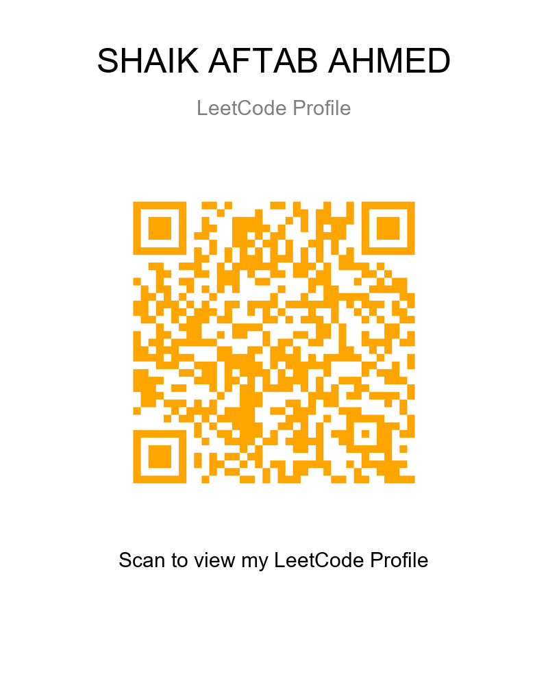

# QR-Based Profile Card Generator

<p align="center">
  
</p>
A Python-based utility that generates a branded profile card by combining QR code generation, image processing, dynamic text rendering, and automated layout management.

The application converts a user profile URL into a scannable QR code and programmatically composes a professional profile card containing personalized metadata such as name, profile title, and call-to-action text.

## Key Features

- QR code generation from user-defined URLs
- High error-correction QR encoding
- Dynamic image composition using Pillow
- Automatic text measurement and center alignment
- Custom typography support
- Configurable QR colors and card dimensions
- PNG image export

## Technical Skills Demonstrated

### QR Code Generation
- Data encoding using the `qrcode` library
- Error correction handling (`ERROR_CORRECT_H`)
- QR customization through color and sizing parameters

### Image Processing
- Programmatic image creation
- Layer-based image composition
- Image resizing and placement
- Raster image export

### Typography & Layout Engineering
- Dynamic font loading
- Bounding-box calculations for text positioning
- Responsive content alignment
- Automated UI layout generation

### Python Concepts Applied
- Object-oriented library usage
- Exception handling (`try-except`)
- File I/O operations
- Coordinate-based rendering
- Modular image manipulation workflows

## Technology Stack

- Python
- Pillow (PIL)
- qrcode

## Workflow

```text
Profile URL
     │
     ▼
QR Code Generation
     │
     ▼
Image Canvas Creation
     │
     ▼
Dynamic Text Rendering
     │
     ▼
QR Placement & Alignment
     │
     ▼
PNG Export
```

## Output

The program generates a professionally formatted profile card that can be used for:

- Portfolio sharing
- Developer profiles
- Event badges
- Resume QR integration
- Professional networking

## Learning Outcomes

This project provided practical experience in:

- Digital image processing
- Coordinate systems and layout design
- QR encoding techniques
- Font rendering and text metrics
- Programmatic graphic generation
- Python-based automation of visual assets

## Future Enhancements

- Logo embedding within QR codes
- Gradient and themed card templates
- Profile picture integration
- Batch profile card generation
- GUI-based customization
- Social media card exports

## Author

**SHAIK AFTAB AHMED**
